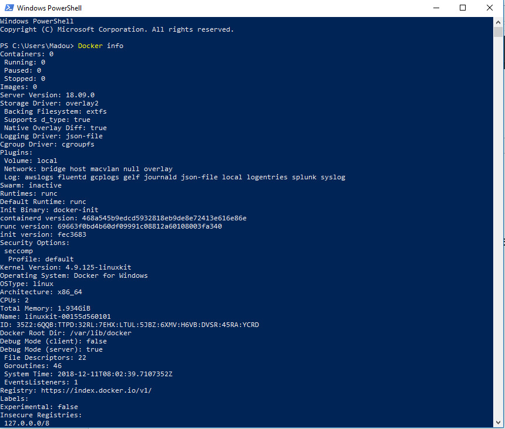
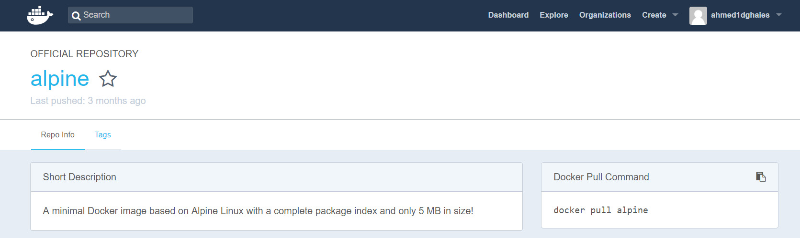

## Docker
After downloading Docker for windows and installing it we need to check the installation by opening a Windows PowerShell and type `Docker info`

We can see here that we are using Docker on windows but the OSType is linux

For the time being we have an empty Docker:

Now let’s look for a small image to download and try going to hub.docker.com

