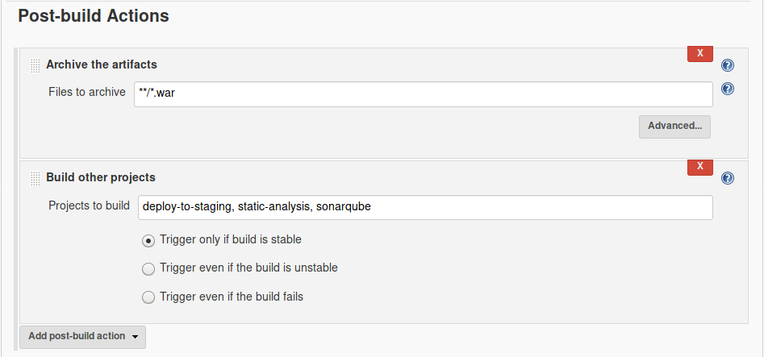
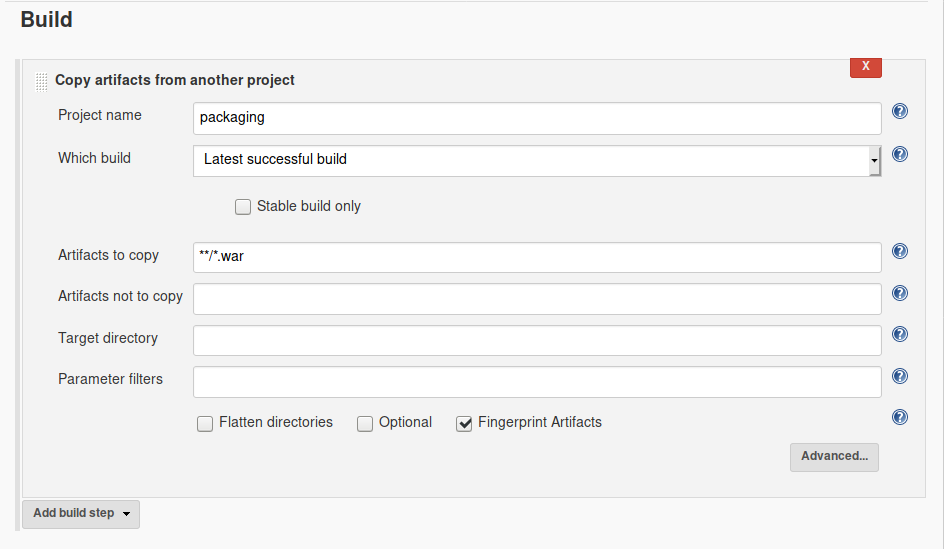
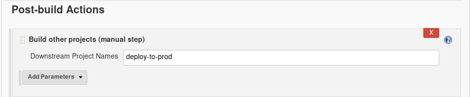

# Jenkins Pipeline

This is the pipeline we are going to create:

## Why the use of pipeline
Making a build based on pipeline have a lot of benifits:
- separation of concern. ie: focus on each job separaly of the others.
- If the build fails in a secondary step, the project won't broke-up.
- Adding a step or removing a step becomes really easy.
- Configuration becomes really fast and easy.

> in this example, we have encountered an error in `static-analysis` and `sonarqube` jobs and that didn't affect the deployment process at all

## Pipeline process
- `pacakaging` project will generate a `.war` file and will archived thanks to ``

- after successful build it will trigger automatically three projects:
  - `deploy-to-staging`
  - `static-analysis`
  - `sonarqube`

- The projects in the pipeline will benifit from the image built previously by the `packaging` project thanks to `copy to artifact` plugin.

- The project `deploy-to-staging` will deploy the package result to tomcat server using the plugin `deploy to container` like we've seen before in [Tomcat](#tomcat).
> Unlike the other projects, `deploy-to-staging` will be triggered manually by the admin after revising the results of both `static-analysis` and `sonarqube` projects and after testing the the app in the development server

