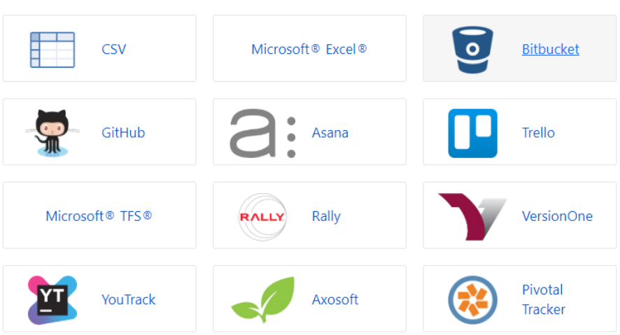
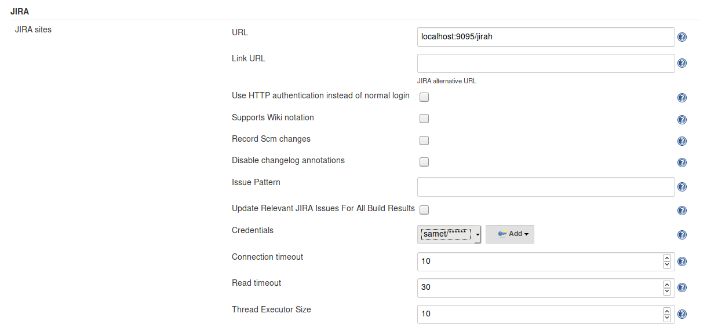

# Jira plugin

Jira Software is agile project management designed for teams of every shape and size. Thousands of apps Install plug-and-play apps from the Atlassian Marketplace to extend Jira Software to fit any need or use case.[atlassian.com]

## Basic use
- First we need an account in [atlassian.com](https://atlassian.com) to be able to download an essai version of jira.
- Then, import project:

- We choose github as source then we select the project to create

## Jenkins integration
- To integrate jira inside jenkins, first install jira plugin
- Then, we just have to configure jenkins plugin inside `Configure System` like so:

[atlassian.com]: (https://www.atlassian.com/software/jira)
