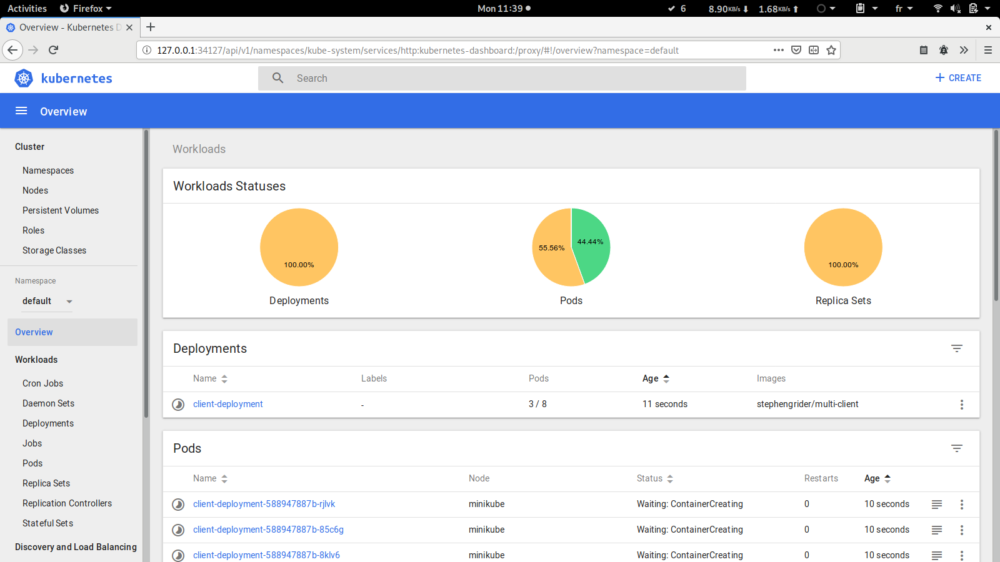
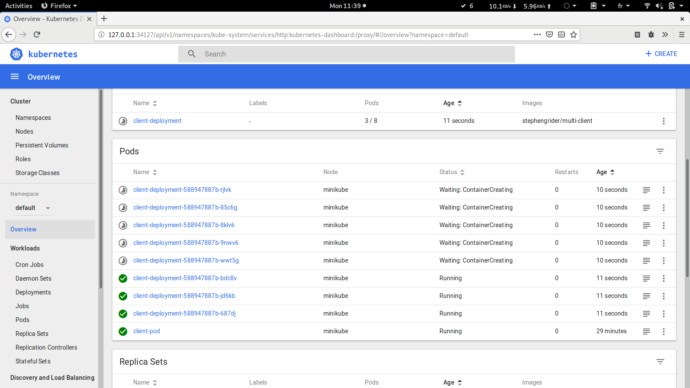

# Kubernetes
## Introduction
- Kubernetes is a tool for orchestration and management of docker containers in distrubteds nodes.
- We are going to use `minikube` tool to create different nodes as virtualbox VM.
- Kuberenetes give us many types of objects that contain and help configure containers like:
  - StatefulSet
  - ReplicaContainer
  - Pod
  - Service
- We are going to use 3 of them:
  - `Pod`: runs one or closely related containers
  - `Service`: Sets up networking in kubernetes cluster
- Each set objects is defined within an apiVersion that is defined in top of configuration file.
- Kuberntes load the work configuration from a `yaml` or `yml` config file and based on that configuraion it creates, manage or delete containers.
  - to change the current configuration: `kubectl apply -f <file_name>`.
  - to get running objects: `kubectl get <object_name>`
- While using kubernetes there are two approaches: `imperative` and `declarative`. Overall the process we are going to use the `declarative` approach.

## Setup
Like docker, installing and running `kubernetes` and `minikube` doesn't require a lot of work inside UNIX-like os.
- install `kubernetes` from the official repositories
- install `virtualbox` because minikube VM are base on virutal box
- install `minikube` from the official repositories

After installing both, we are going to run minikube:
``` bash
[MohamedAmin@samet]$ minikube start
There is a newer version of minikube available (v0.32.0).  Download it here:
https://github.com/kubernetes/minikube/releases/tag/v0.32.0

To disable this notification, run the following:
minikube config set WantUpdateNotification false
Starting local Kubernetes v1.10.0 cluster...
Starting VM...
Getting VM IP address...
Moving files into cluster...
Setting up certs...
Connecting to cluster...
Setting up kubeconfig...
Starting cluster components...
Kubectl is now configured to use the cluster.
Loading cached images from config file.
```

## Understanding kubernetes basics
We are going to understand kubernetes basics while using the configuration files inside: [k8s](k8s).
### First step
- At the beginning pods were created
``` bash
[MohamedAmin@samet k8s]$ kubectl get pods
No resources found.
```
- a predfinded service of kuberentes is created from the early beginning
``` bash
[MohamedAmin@samet k8s]$ kubectl get services
NAME         TYPE        CLUSTER-IP   EXTERNAL-IP   PORT(S)   AGE
kubernetes   ClusterIP   10.96.0.1    <none>        443/TCP   18d
```
### Loading configuration
- loading [client-pod.yaml](k8s/client-pod.yaml) configuration file
``` bash
[MohamedAmin@samet k8s]$ kubectl apply -f client-pod.yaml
pod "client-pod" created
[MohamedAmin@samet k8s]$ kubectl get pods
NAME         READY     STATUS              RESTARTS   AGE
client-pod   0/1       ContainerCreating   0          4s
[MohamedAmin@samet k8s]$ kubectl get pods
NAME         READY     STATUS    RESTARTS   AGE
client-pod   1/1       Running   0          30s
```
- loading [client-node-port.yaml](k8s/client-node-port.yaml) configuration file
``` bash
[MohamedAmin@samet k8s]$ kubectl apply -f client-node-port.yaml
service "client-node-port" unchanged
[MohamedAmin@samet k8s]$ kubectl get services
NAME               TYPE        CLUSTER-IP      EXTERNAL-IP   PORT(S)          AGE
client-node-port   NodePort    10.101.204.26   <none>        3050:31515/TCP   16d
kubernetes         ClusterIP   10.96.0.1       <none>        443/TCP          18d
```
### Understanding minikube concept
- The pod and the service were running perfectly, but if we type `docker ps` nothing appeared. No container were created inside our system.
``` bash
[MohamedAmin@samet k8s]$ sudo docker ps
CONTAINER ID    IMAGE         COMMAND       CREATED      STATUS        PORTS        NAMES
```
- This is because both of the service and the pod were running inside the minikube VM.
- Type `minikube ip` and you'll get its ip. Based on our configuraion, you can visit `$(minikube ip):31515` and you'll find the interface of the react app
``` bash
[MohamedAmin@samet k8s]$ minikube ip
192.168.99.100
```
- To configure docker to access to minikube environment type `eval $(minikube docker-env)` and this will load minikube docker-environment variables inside your current terminal session window
```
[MohamedAmin@samet k8s]$ minikube docker-env
export DOCKER_TLS_VERIFY="1"
export DOCKER_HOST="tcp://192.168.99.100:2376"
export DOCKER_CERT_PATH="/home/MohamedAmin/.minikube/certs"
export DOCKER_API_VERSION="1.35"
# Run this command to configure your shell:
# eval $(minikube docker-env)
```
### Deleting loaded configuration
- Finally, to delete a configuration you can just type `kubectl delete -f <configuration-file>`
``` bash
[MohamedAmin@samet k8s]$ kubectl delete -f client-pod.yaml
pod "client-pod" deleted
[MohamedAmin@samet k8s]$ kubectl get pods
NAME         READY     STATUS        RESTARTS   AGE
client-pod   0/1       Terminating   0          2m
```
- To stop minikube
`minikube stop`

## Deployment object
- The deployment object allow us to run as many containers as we want.
- The management of load blancing and number of containers (ie. deleting and creating of containser inside nodes depending on the need) is done by kubernetes master.
- kubernetes master will figure out a way to serve creating containers as the we need. No explicit imperative commands are needed, just a configuration inside the configuration file.
- In the example below, we configured the deployment configuration file to run 8 pods. The master will create them one by one to serve the need.
- Loading [client-deployment.yaml](k8s/client-deployment.yaml) config file
``` bash
[MohamedAmin@samet k8s]$ kubectl apply -f client-deployment.yaml
deployment.apps "client-deployment" configured
[MohamedAmin@samet k8s]$ kubectl get pods
NAME                                 READY     STATUS              RESTARTS   AGE
client-deployment-588947887b-24rrd   0/1       ContainerCreating   0          11s
client-deployment-588947887b-2tlmb   1/1       Running             0          11s
client-deployment-588947887b-8tgqg   1/1       Running             0          11s
client-deployment-588947887b-9xmvr   0/1       ContainerCreating   0          11s
client-deployment-588947887b-ctn87   1/1       Running             0          39s
client-deployment-588947887b-jpszs   0/1       ContainerCreating   0          11s
client-deployment-588947887b-lql9h   0/1       ContainerCreating   0          11s
client-deployment-588947887b-vwkrc   1/1       Running             0          11s
client-pod                           1/1       Running             0          22m
```

## Dashboard
- kubernetes team have created a very useful dashboard fully integrated with kubernetes and works perfectally fine.
- To install it from minikube addons:
`minikube addons enable dashboard`
- To run the dashboard:
` minikube dashboard`
---

---
---

---


## Jenkins Kubernetes plugin
Using kubernetes plugin, we can trigger kuberntes configuration like so where yaml configuration files are provided inside the project.  

