# Main App

Note that all the project we are going to use are of type `free style project`. It's quite possible to select the `maven project` type because al jobs we are going to create are maven based jobs.

## Structure
The app is `docker-compose` based containing:
- services:
  - jenkins_full:
    - configured jenkins image
    - port: `8080`
  - mongo:
    - database for spring-boot app
    - mongo data are stored in `./data/mongod`
  - sonarqube:
    - launch sonarqube
    - port: `9090`
  - sonar_db:
    - postgresql databse to store sonarqube data
    - uses `postgresql` and `postgresql_data`
  - tomcat:
    - developement tomcat serever
    - port: `8090`
  - tomcat_deploy:
    - deployment tomcat server
    - port: `8091`

- volumes:
  - sonarqube_conf:
    - stores sonarqube configuration
  - sonarqube_data: 
    - stores sonarqube data
  - sonarqube_extensions:
    - stores sonarqube extensions
  - postgresql:
    - stores postgresql
  - postgresql:
    - stores postgresql data

## Jenkins
### Global tool configuration
- jdk
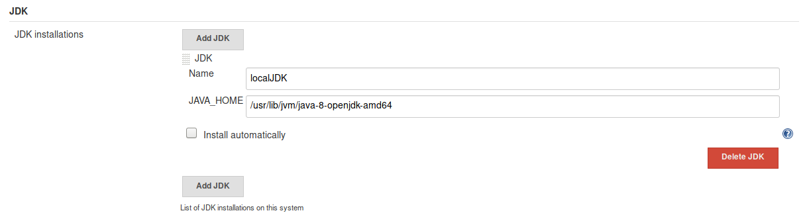

- git
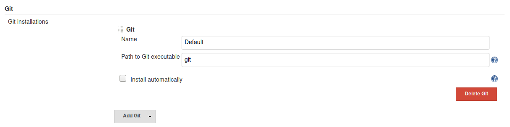

- maven
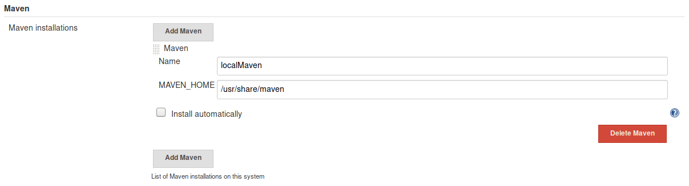


### Plugins
While building the developement environement, we are going to use these plugins. We'll explain the use of each later on.
- GitHub plugin
- Checkstyle Plug-in
- Pipeline
- Build Pipeline Plugin
- Copy Artifact Plugin
- Deploy to container Plugin
- Jira plugin

### starting new project
- source code
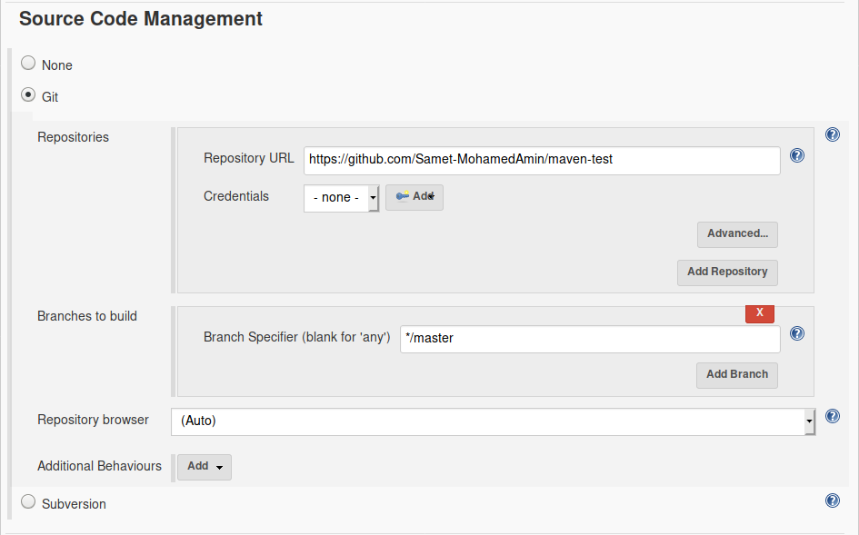

- build triggers
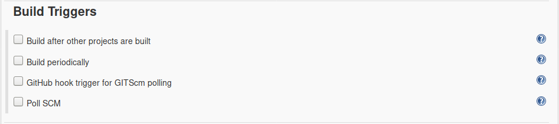


## Checkstyle
- trigger checkstyle via maven
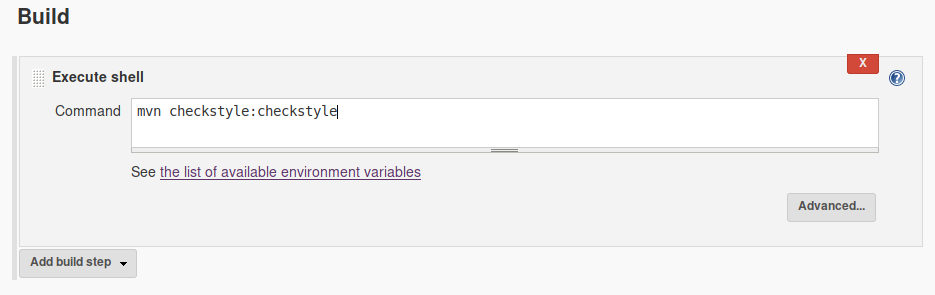

- activate checksyle plugin
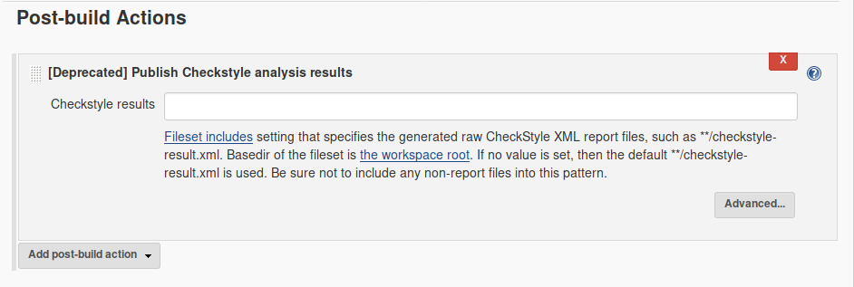

- Then in every successful build, we can view checkstyle result and a detailed review of the code.
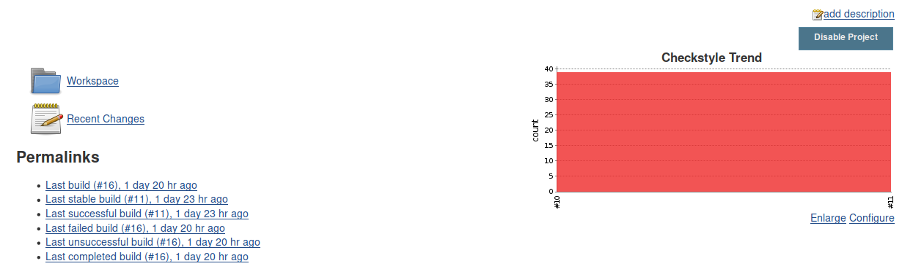
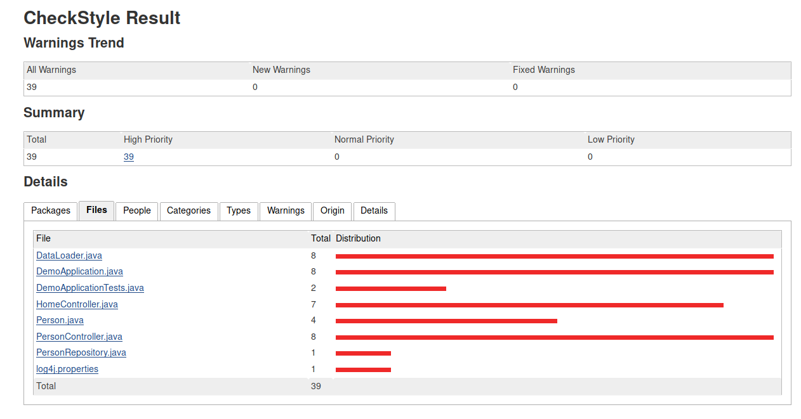

> Sonarqube may include by default checkstyle features, but we've added the static analysis step just for demonstration purposes.


## Tomcat
In this app we prepared two tomcat servers: One as developement server and the other as deployment server.

- Tomcat job configuration
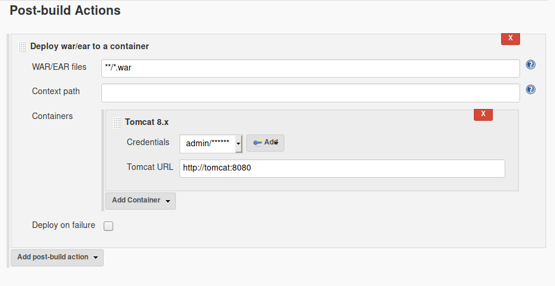

## Sonarqube
_paragraph not updated yet_  
[take a look here](./sonarqube.md)


Sonarqube configuaraions are described within spring-boot project properties
``` xml
  <properties>
    <!-- ... -->
    <sonar.host.url>${SONAR_HOST}:9000</sonar.host.url>
    <sonar.projectName>demo_app</sonar.projectName>
    <sonar.login>admin</sonar.login>
    <sonar.password>admin</sonar.password>
    <!-- ... -->
  </properties>
```

- To tigger build:
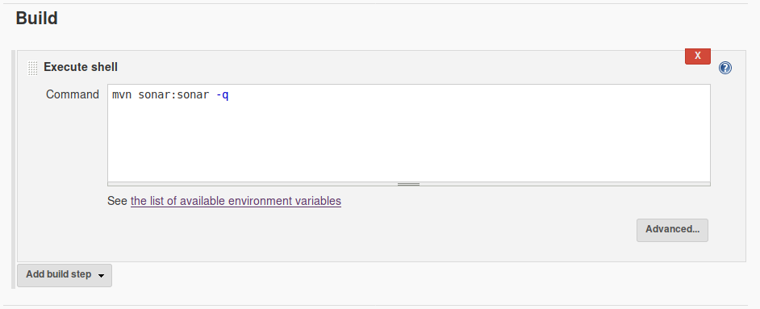


