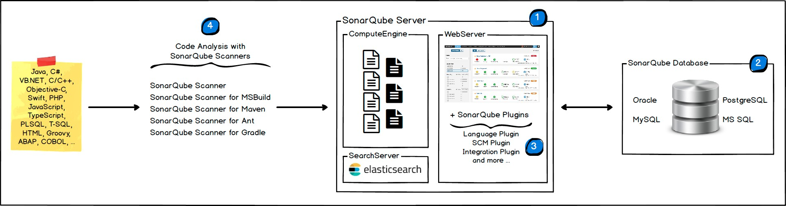
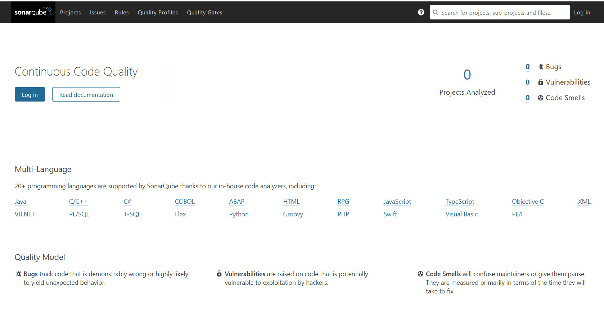
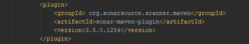
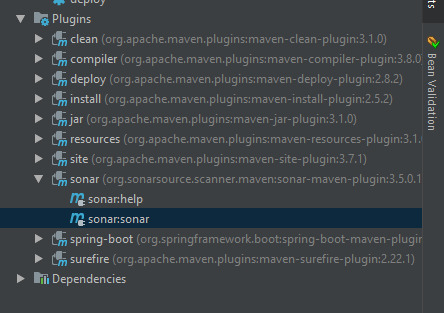
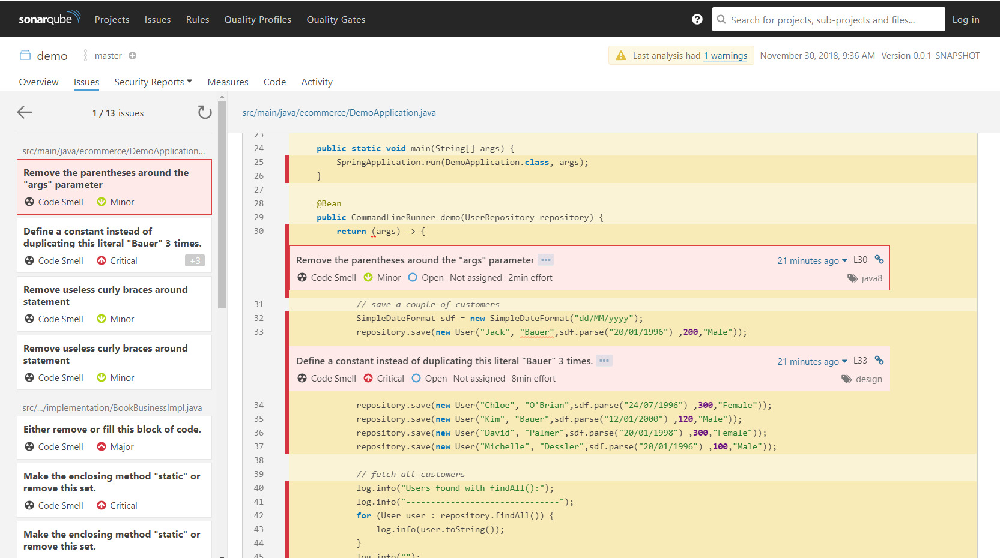

# Tools description and use
## Docker
### Setup
#### Installation
By default docker is provided within most of the official distrubtion repositories and it is designed to work perfectly inside a Unix-like envirnment. So in general no configuration is needed.  
- basic installation:
``` bash
[MohamedAmin@samet ]$ sudo dnf install docker -y
```

> In some cases when the official repositories does not offer the newest features that we want to use, following these installation instructions may be helpful https://docs.docker.com/install/linux/docker-ce/fedora

#### Run service
There are some different models to manage containers. Docker implements the `client/server` model. Docker is set of tools that manipulates docker containers. And in general docker is composed of docker client that communicates with the Docker daemon via a client/server operation. Then the Docker daemon creates the container and handles communications of stdin/stdout back to the Docker client tool.
Then when whenever we want to use docker, we have to run docker server

in fedora:
``` bash
[MohamedAmin@samet ]$ systemctl start docker
```

- view the status of docker server: `$ systemctl status docker`
``` bash
● docker.service - Docker Application Container Engine
   Loaded: loaded (/usr/lib/systemd/system/docker.service; disabled; vendor pre>
   Active: active (running) since Sun 2018-12-23 20:50:54 CET; 1h 50min ago
     Docs: https://docs.docker.com
 Main PID: 5059 (dockerd)
    Tasks: 230
   Memory: 85.4M
      CPU: 53.170s
   CGroup: /system.slice/docker.service
           ├─ 5059 /usr/bin/dockerd
           ├─ 5070 docker-containerd --config /var/run/docker/containerd/contai>
           ├─ 5752 /usr/bin/docker-proxy -proto tcp -host-ip 0.0.0.0 -host-port>
           ├─ 5789 /usr/bin/docker-proxy -proto tcp -host-ip 0.0.0.0 -host-port>
           ├─ 5860 /usr/bin/docker-proxy -proto tcp -host-ip 0.0.0.0 -host-port>
           ├─ 5873 /usr/bin/docker-proxy -proto tcp -host-ip 0.0.0.0 -host-port>
```

### Demonstration
Overall the application, we are going to use `docker-compose` and benifit from its network management strategy, port-mapping, mounting volumes..
You can take a look at [docker-compose](app/docker-compose.yml) file and view its content.


## Sonarqube
The SonarQube Platform is made of 4 components:


1. One SonarQube Server starting 3 main processes:
    - Web Server for developers, managers to browse quality snapshots and configure the SonarQube instance
    - Search Server based on Elasticsearch to back searches from the UI
    - Compute Engine Server in charge of processing code analysis reports and saving them in the SonarQube Database
2. One SonarQube Database to store:
    - The configuration of the SonarQube instance (security, plugins settings, etc.)
    - The quality snapshots of projects, views, etc.
3. Multiple SonarQube Plugins installed on the server, possibly including language, SCM, integration, authentication, and governance plugins
4. One or more SonarScanners running on your Build / Continuous Integration Servers to analyze projects


We can work online on SonarQube in the last versions but we will be installing it locally for this project, let’s start with installing and lunching SonarQube:  




After unzipping the content of the zip downloaded in `C:\SonarQube-7.4` foe example, we can start it with a simple command 
`C:\SonarQube-7.4\bin\windows-x86-64\StartSonar.bat`
Then going to http://localhost:9000 we will see the home page of SonarQube 




To test SonarQube we will be using maven project, so we need to add sonar plugin into `pom.xml`




After running clean and install, we can run `sonar:sonar` plugin




After a build success we can now open http://localhost:9000 to observe this interface that contains the projects analyzed by SonarQube and the detected issues.




Thus in intelIj we can add a plugin called SonarLint that do scan the code for issues and errors


## Jenkins


